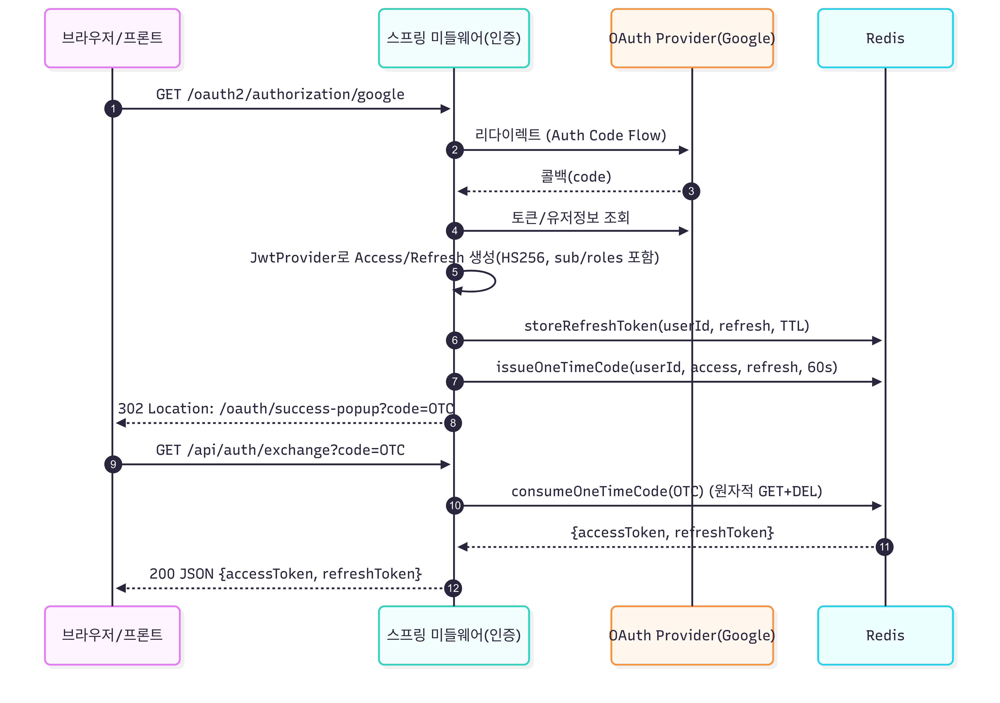
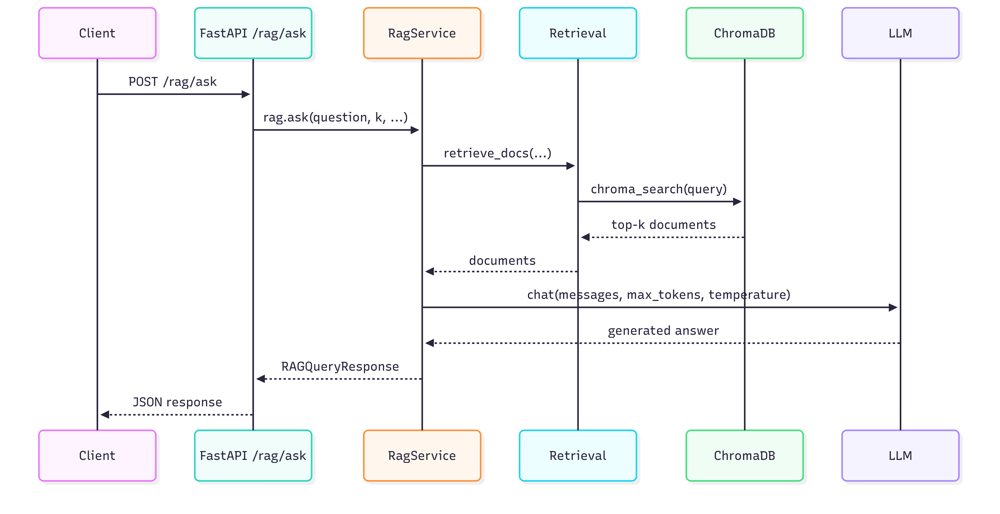
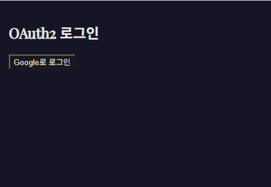
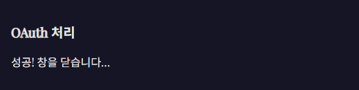
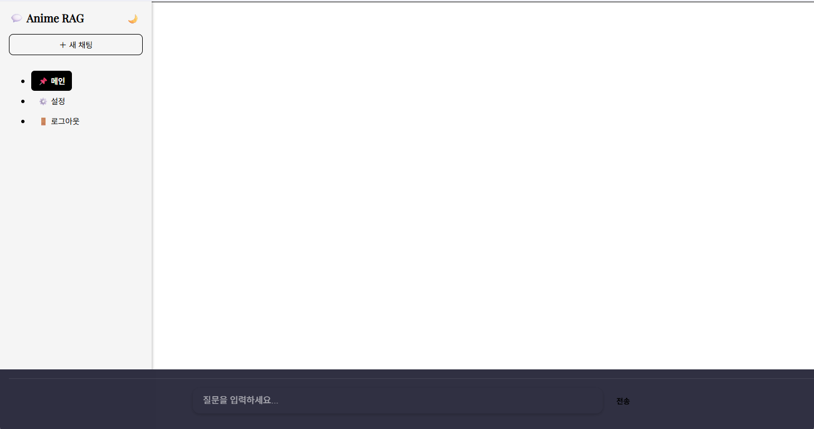
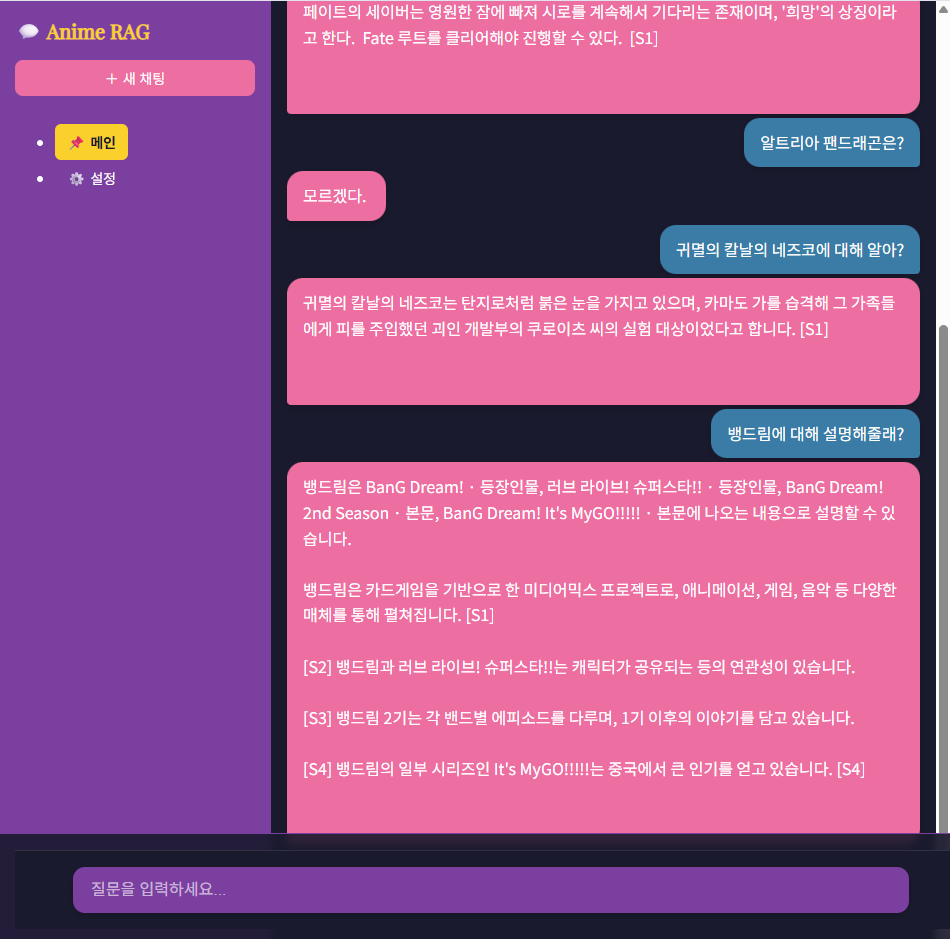

# Anime RAG Stack — Full Pipeline Portfolio

---

https://arin-nya.tistory.com/160

위 링크의 내용대로 대격변 예정.
세부 내용은 변경 가능.

---

도메인 특화 **Retrieval-Augmented Generation (RAG)** 백엔드 (애니메이션 문서 기반).  
데이터 크롤링 → 벡터 DB 튜닝 → 프롬프트 설계 → 보안 API까지 **엔드-투-엔드**로 구현.
> - RawData, Vector DB, Prompt Template, Embedding Model 교체로 도메인 전환 가능  
> - 애니메이션 문서 외에도 내부 문서, 법률, 기술 FAQ 등 다양한 활용 가능성

## 요약

이 프로젝트는 **애니메이션 도메인 문서에 특화된 RAG 시스템**입니다.  
사용자는 대화형 UI를 통해 **애니 관련 질문**을 입력하면,  
나무위키 문서 기반 벡터 검색 + LLM 조합으로 **정확한 문서 인용과 답변**을 받을 수 있습니다.

> 예: "신이 된 히로인의 서사가 있는 애니메이션은?" → "스즈미야 하루히의 우울"

### 주요 특징

- **다양한 애니메이션 문서를 문맥 기반으로 검색**  
    - 2006~2025년 나무위키에서 수집한 7,700여 개 문서 활용  
    - 등장인물/설정/줄거리 등 **하위 항목까지 재귀 수집 + 정제**

- **빠르고 정확한 검색 품질**  
    - 검색 정확도 `Hit@8: 84.2%`, 문서 중복률 `0.0%`  
    - 검색-응답 전체 응답속도 평균 `p95: 178ms`
    - ※ 위 수치는 title 단위 평가 기준(by=title, distinct_by=title)으로 산출됨
      > 실제 사용자 질문이 문서 전체와 1:1 매칭되기 어려운 도메인 특성상, 가장 보수적 기준 아님

- **로컬 환경에서 즉시 실행 가능**  
    - `Docker Compose` 기반 GPU 추론 포함  
    - OAuth2 로그인, JWT 발급, Redis 인증 캐시까지 포함된 전체 인증 흐름 구축

- **API 제공**  
    - `/rag/ask` 엔드포인트에서 단일 요청으로 RAG 응답 처리

- **도메인 전환 용이**  
    - RawData, Vector DB, Prompt Template, Embedding Model 교체만으로 전환 가능  
    - 애니메이션 외에도 법률, 사내 문서, 기술 FAQ 등 다양한 활용 가능

>  UI, 성능 벤치마크, 아키텍처 다이어그램은 아래 섹션에서 확인할 수 있습니다.
> GPT의 코드 제안 기능을 활용해 구현했으며, 전체 아키텍처 설계, 프롬프트 전략, 데이터 구성 및 튜닝 실험은 직접 수행했습니다.


## 아키텍처 개요
```
[ React ] ⇄ [ Spring Security 미들웨어 (OAuth2 + JWT + Redis) ] ⇄ [ FastAPI Core (Mongo + Chroma) ] ⇄ [ LLM (Gemma-2-9b-it) ]
```
- 엔드투엔드 플로우: 질의(Query) → 임베딩 → 검색(Retrieval) → MMR → 재랭킹 → 프롬프트 → LLM 응답  
- **Docker Compose** 기반으로 로컬 개발, GPU 추론, 모듈형 오케스트레이션 지원.

---

## Configuration

로컬 개발과 `docker-compose` 배포 환경에 맞춰 설정 파일을 분리.

- **로컬**: `.env.local`과 기본 `application.yml`을 `.env`와 함께 사용
- **Docker**: `.env.docker`와 `application-docker.yml` + `SPRING_PROFILES_ACTIVE=docker`

각 환경에 맞는 파일을 `.env`로 복사한 뒤 서비스를 실행하세요.

/models 디렉토리에 gemma-2-9b-it-Q4_K_M-fp16.gguf 모델이 필요합니다.

구글 GCP의 OAuth2 id/key pair 필요합니다.

---

## Reproducing Locally

다음 절차를 따르면 **`namu_anime_v3.jsonl`**을 Chroma에 색인하고 벤치마크까지 재현할 수 있습니다.

1. **의존성 설치**
   ```bash
   cd rag_demo
   pip install -r requirements.txt
   ```

2. **데이터셋 배치**
   ```bash
   cd app/app/scripts
   curl -L -o namu_anime_v3.jsonl \
     https://huggingface.co/datasets/ArinNya/namuwiki_anime/resolve/main/namu_anime_v3.jsonl
   ```

3. **Chroma 인덱싱** (`reembed_enrich.py`)
   ```bash
   CHROMA_DB_DIR=./chroma_db \
   CHROMA_COLLECTION=namu_anime_v3 \
   DST_COLLECTION=namu_anime_v3_enriched \
   python reembed_enrich.py
   ```

4. **성능 지표 산출** (`rag_optuna_tune_v2.py`)
   ```bash
   CHROMA_DB_DIR=./chroma_db \
   CHROMA_COLLECTION=namu_anime_v3_enriched \
   python rag_optuna_tune_v2.py
   ```

5. **서비스 기동**
   ```bash
   cd ../../../..
   cp .env.local .env  # 또는 .env.docker
   docker-compose up --build
   ```

---

## Core Projects

### License
- Code: Apache-2.0
- Dataset: CC BY-NC-SA 2.0 KR (separate license). Non-commercial; ShareAlike.

### 1) RAG Backend API (2025)
> FastAPI 기반 모듈화된 RAG 백엔드. 검색/재랭킹/응답 생성을 지원.

- `/rag/ask`: 검색 기반 LLM 응답 생성
- `/rag/healthz`: 서비스 헬스체크

### 2) NamuWiki Crawler & Cleaner
> 나무위키 기반 대규모 문서 수집 및 전처리 → RAG 최적화 JSONL 생성.

- 대상: 애니메이션 관련 문서 7,700건 (2006~2025)
- 처리: 등장인물/설정 등 하위 링크 재귀 수집, 광고/푸터 제거, 섹션/문단 기반 청킹 (avg ≈ 350 tokens)
- 공개: Hugging Face 데이터셋 → [NamuWiki Anime RAG Dataset](https://huggingface.co/datasets/ArinNya/namuwiki_anime)
- 라이선스: 원본 `CC BY-NC-SA 2.0 KR` (비상업적, 동일조건변경허락)

### 3) Spring Security Middleware
> React ⇄ FastAPI 사이 인증 및 프록시 담당

- OAuth2 팝업 로그인 → JWT 발급
- Redis 기반 Refresh Token + 블랙리스트 로그아웃
- `@AuthenticationPrincipal` 타입 분리 (OAuth2 vs JWT)
- React에서 받은 토큰을 Axios global header에 설정

---

## Bench (2025-09-12, retrieval-only)

조건:

embed: BAAI/bge-m3 (L2 normalized)
retrieval: cosine + MMR(lam=0.65), match_by="title"
k=8, N=400, distinct_by="title", reranker=keep
벡터 DB: Chroma
쿼리 기준: title 단위 gold set, 총 N=38개

| Metric               | Value    | Notes                           |
| -------------------- | -------- | ------------------------------- |
| **Hit\@8**           | 0.8421   | 대부분 쿼리에서 정답 타이틀 Top-8 내 포함      |
| **Recall\@8**        | 0.8421   | 중복 제거 후 실제 recall (=Hit\@8과 동일) |
| **MRR**              | 0.8264   | 정답 평균 랭킹 ≈ 1.2순위                |
| **nDCG**             | 0.8494   | 순위 품질 반영된 정규화 DCG               |
| **Recall\@50 (raw)** | 0.8421   | rerank 적용 전 Top-50 기준 recall    |
| **dup\_rate**        | 0.0000   | Top-K 내 title/doc 중복 없음         |
| **p95 latency**      | 178.29ms | `/rag/ask` 기준: 검색 모듈만 측정        |


**환경**: Ryzen 7 9800X3D / 64GB RAM / RTX 5080 (VRAM 16GB)  
※ 로컬 측정값. 클라우드/프로덕션과 다를 수 있음.

※ 본 수치는 by=title + distinct_by=title 평가축 결과입니다. by=doc/seed로 바꾸면 절대값은 낮아집니다.

---

## API 개요

이 RAG 백엔드는 **검색 기반 답변 생성**을 위한 최소 엔드포인트만 노출합니다.

### 엔드포인트
| Path           | Method | Description                            |
|----------------|--------|----------------------------------------|
| `/rag/ask`     | POST   | End-to-end RAG (retrieval → LLM)       |
| `/rag/healthz` | GET    | 헬스체크 (서비스 가용성 확인)            |

> 인증: `Authorization: Bearer <token>` 필요 (Spring Security 미들웨어에서 JWT 검증)

### 요청/응답 예시
요청:
```http
POST /rag/ask?k=6&use_mmr=true&lam=0.5&max_tokens=512&temperature=0.2&preview_chars=600 HTTP/1.1
Authorization: Bearer ACCESS
Content-Type: application/json

{
  "question": "신이 된 히로인의 서사가 있는 애니메이션은?"
}
```
응답 (`RAGQueryResponse`):
```json
{
  "question": "신이 된 히로인의 서사가 있는 애니메이션은?",
  "answer": "스즈미야 하루히의 우울",
  "documents": [
    { "id": "doc1#0", "title": "스즈미야 하루히의 우울", "score": 0.83, "text": "..." }
  ]
}
```

관련 코드
```
app/
└── api/
    └── rag_router.py   ← /rag/ask, /rag/healthz
```

---

## Sequence Diagrams

### 로그인 흐름 (OAuth2 → JWT → OTC 발급)


### API 요청 흐름 (프록시 + Redis 블랙리스트 검증)


### 로그아웃 흐름 (Redis 블랙리스트 + Refresh 삭제)


### Ask API 전체 흐름
> `/rag/ask` → 문서 검색 → LLM 응답 → JSON 반환


---

## UI 시연 자료 (Screenshots)

**1) OAuth2 로그인 화면**  


**2) OAuth 처리 성공 (팝업 자동 종료 직전)**  


**3) 메인 대화형 RAG UI**  


**3.1) 메인 대화형 RAG UI 테마 변경**  


**4) 실제 사용 UI**  


---

## Tech Highlights
- **MMR Re-ranking**: 다양성 보장, 중복 제거
- **Chunking Strategy**: 한국어 종결어미/제목 기반 청킹
- **Benchmark Utilities**: recall@k, dup_rate, p95 등
- **Embeddings**: bge-m3 사용

---

## Roadmap

### Done
- 데이터 수집/정제: 7,700건, 하위 링크 재귀, 광고/푸터 제거, 섹션/문단 청킹, HF 공개
- 벡터 DB & 검색: Chroma + MMR, BM25 대비 개선, Optuna 튜닝 환경
- LLM 연동: Gemma-2-9b-it 로컬 서빙, Jinja2 프롬프트
- 백엔드: FastAPI `/rag/ask`, `/rag/healthz`, 품질/성능 지표 유틸
- 미들웨어 & 인증: OAuth2 → JWT, Redis Refresh/Blacklist, React↔Spring↔FastAPI 프록시
- 프론트엔드: GPT-style 대화 UI, OAuth2 팝업 처리, Axios 헤더 자동화
- 배포/환경: Docker Compose, GPU 추론

### In Progress
- Optuna 기반 파라미터 고도화 (`fetch_k`, `mmr_k`, `rerank_in`…)
- RAG 품질 튜닝 및 실험 결과 문서화
- UI 개선 (참조 문서 하이라이트 등)

### Next
- 사용자 검색 로그/분석
- 로컬+클라우드 하이브리드 서빙
- 데이터셋 확장 (ex. 픽시브 태그)

---

## Links
- **Blog**: [기술 아키텍처 및 구현 기록](https://arin-nya.tistory.com/)
- **Dataset**: [NamuWiki Anime RAG Dataset](https://huggingface.co/datasets/ArinNya/namuwiki_anime)
